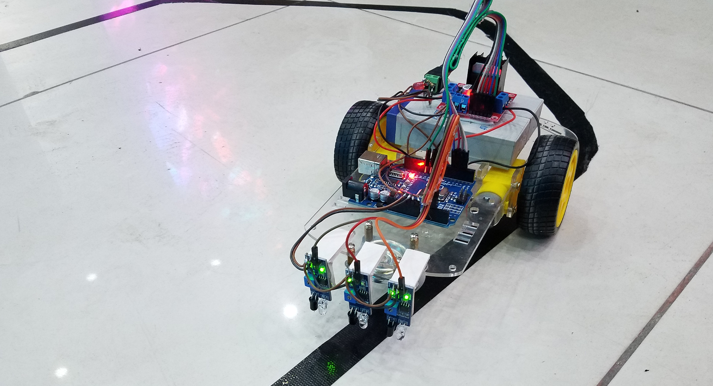

<!-- ABOUT THE PROJECT -->
## Autonomous Reliable Car
This repository includes two projects:
* Line Follower Car
* Cam Car

Check out my [blog post](https://erolgelbul.com/project-blog/autonomous-car) for more information on each project.

## Summary of Components

* Embedded Platform: Robot car initio (from 4tronix)
* Raspberry PI boards
* Linux kernel with real time Patch PREEMT_RT

<!-- INSTALL -->
## Installations

-Windows

Cygwin can be download through [here](https://cygwin.com/install.html).

1. Run the installer.
2. While you are selecting packages: choose make and gcc.

-MacOS

1. Open application Terminal.
2. `sudo xcode-select --install` to install gcc.
3. make is already installed on MacOS by default.

-Linux

Linux (depending on the distribution) usually come with gcc and make installed. If not:

1. sudo apt-get install make
2. sudo apt-get install gcc

(<a href="#top">back to top</a>)

<!-- CONTRIBUTING -->
## Contributing

If you would like to add any extra features to the optimisation simulation, feel free to fork and create a pull request. Thank you!

1. Fork the Project
2. Create your Feature Branch (`git checkout -b feature/AmazingFeature`)
3. Commit your Changes (`git commit -m 'Add some AmazingFeature'`)
4. Push to the Branch (`git push origin feature/AmazingFeature`)
5. Open a Pull Request

(<a href="#top">back to top</a>)

<!-- CONTACT -->
## Contact

Erol Gelbul - [Website](http://www.erolgelbul.com) - erolgelbul@gmail.com

Project Link: [Autonomous Reliable  Car](https://github.com/ErolGelbul/autonomous_reliable_car)

(<a href="#top">back to top</a>)

<!-- ACKNOWLEDGMENTS -->
## Acknowledgments

I would like to thank my tutor, Raimund Kirner for his time and support.

(<a href="#top">back to top</a>)

